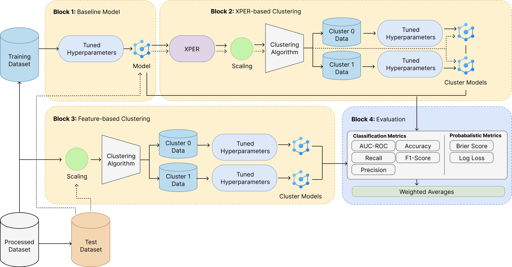

# XPER Clustering

> **Graduate Thesis Repository – _Mitigating Performance Heterogeneity via XPER‑Based Clustering_**

---

**X**‑plainable **Per**formance (XPER) is a novel model‑agnostic interpretability framework that measures the marginal contribution of a particular feature to the predictive performance of a regression or classification model ([Hué et al., 2022](https://www.researchgate.net/publication/366212631_Explainable_Performance)). 

This repository provides all code to reproduce the experiments and figures for my graduate thesis, in which I investigate whether **clustering instances on their local XPER vectors can reduce model‑performance heterogeneity**, and secondly whether building cluster specific models improves model generalizability.

<p align="center">
  <em>Methodology overview</em><br>
  <!-- Update the path once the image is committed -->
  
</p>

---

## Key Idea

1. **Train a baseline XGBoost model** on the *credit_risk* dataset.
2. **Compute local XPER vectors** for every training instance.
3. **Cluster** these vectors with *K‑Means*, *K‑Medoids*, and *Gaussian Mixture Models* (GMM).
4. **Retrain cluster‑specific XGBoost models** on the raw features of each cluster.
5. **Evaluate** on test data that are first assigned to a cluster via the pretrained clustering model.
6. **Benchmark** against models trained on clusters built from the original (untransformed) feature space.
7. **Analyse and visualise** performance, heterogeneity, and feature contributions.

All artefacts (data splits, models, plots, metrics) are stored in a timestamped directory under `experiments/`.

---

## Repository Structure

```text
XPER_clustering/
├── analysis/               # Notebooks & scripts for extended analysis
│   ├── aggregate_experiment_analysis.ipynb
│   ├── baseline_model_analysis.py
│   ├── cluster_analysis.py
│   ├── data_split_consistency.ipynb
│   ├── exploratory_analysis.ipynb
│   ├── feature_versus_xper_outliers.ipynb
│   └── heterogeneity.ipynb
├── core/                   # Main experiment pipelines
│   ├── cluster_pipeline.py
│   └── global_pipeline.py
├── data/                   # Local copies of public datasets & loader
│   ├── ...
│   ├── credit_risk/
│   └── loader.py
├── experiments/            # Auto‑generated experiment outputs (git‑ignored)
├── utils/                  # Helper functions
│   └── utils.py
├── visualization/          # Plotting utilities
│   ├── cluster_visualizations.py
│   └── global_visualizations.py
├── config.py               # Central experiment configuration
├── requirements.txt
└── README.md               # You are here 🚀
```

---

## ⚙️ Requirements

* **Python >= 3.12**
* All packages listed in `requirements.txt`

### Quick Install

```bash
# (Optional) create an isolated environment
python3.12 -m venv venv
source venv/bin/activate   # Windows: venv\Scripts\activate

# Install dependencies
pip install -r requirements.txt
```

---

## Getting Started

1. **Clone the repo**
   ```bash
   git clone https://github.com/schronic/xper_clustering.git
   cd xper-clustering
   ```
2. **Configure your run** – open `config.py` and adjust parameters such as:
   | Variable | Purpose |
   |----------|---------|
   | `SAMPLE_SIZE` | Number of rows sampled from the dataset |
   | `N_FEATURES`  | Number of features retained |
   | `CLUSTERS`    | Fixed \(k\) or `None` to use Silhouette‑based optimisation |
   | `KERNEL_USE`  | Enable RBF kernel approximation (bool) |
3. **Run the global pipeline**
   ```bash
   python -m core.global_pipeline
   ```
   ➡️ Creates `experiments/experiment_YYYYMMDD_HHMMSS/` with base models, XPER files, and first plots.
4. **Deep‑dive per‑cluster**
   *Edit the `EXPERIMENT_FOLDER` at the top of `core/cluster_pipeline.py` to point to the folder created in step 3, then run:*
   ```bash
   python -m core.cluster_pipeline
   ```
5. **Aggregate across experiments** (optional)
   ```bash
   jupyter notebook analysis/aggregate_experiment_analysis.ipynb
   # or run the analysis script directly
   python analysis/cluster_analysis.py
   ```

All thesis‑related experiment outputs are also available in [this shared Google Drive folder](https://drive.google.com/drive/folders/1kPobSBmtKVLTsMx6glIjV_CHd4ns2Z1F?usp=sharing).

---

## Outputs & Logs

Each experiment folder contains:

| Path | Contents |
|------|----------|
| `models/` | Global & cluster‑specific XGBoost binaries |
| `data/`   | Train/Test CSVs, cluster assignments |
| `xper_values/` | Local & global XPER CSVs |
| `visualizations/` | PNG/HTML plots generated during the run |
| `final_results.csv` | Metrics for the given dataset |
| `overall_results.csv` | Aggregated metrics across datasets |

Additional files produced by `analysis/` scripts include combined Excel sheets (`*_combined_analysis_frames.xlsx`) and inter‑experiment comparison plots housed in `analysis_plots_clusters/`.

---